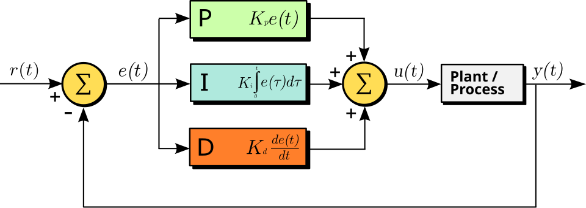
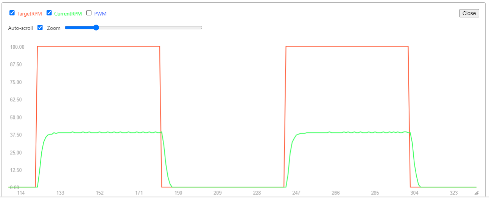
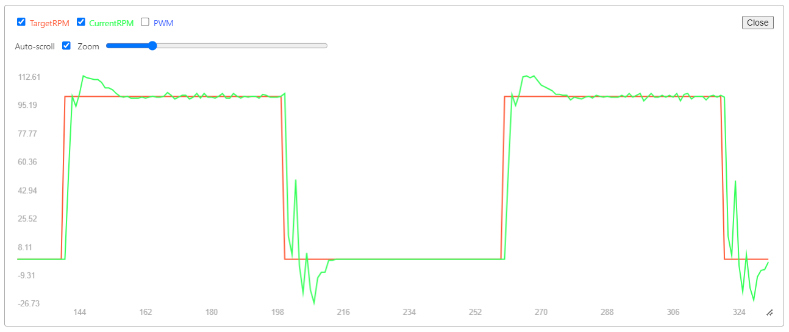

# PID Control


## 📘 Theory Summary

A PID controller is a control loop feedback mechanism widely used in industrial control systems and a variety of other applications requiring continuously modulated control. It continuously calculates an error value `e(t)` as the difference between a desired setpoint (SP) `r(t)` and a measured process variable (PV) `y(t)` and applies a correction based on proportional, integral, and derivative terms.

{ width="50%" }

### Pseudocode

=== "PID Controller Structure"
    ```plaintext
    initialize variables
    loop:
        calculate error
        calculate integral
        calculate derivative
        calculate output
        apply output
    ```
=== "Detailed PID Pseudocode"
    ```plaintext
    previous_error := 0
    integral := 0
    loop:
        error := setpoint − measured_value
        proportional := error;
        integral := integral + error × dt
        derivative := (error - previous_error) / dt
        output := Kp × proportional + Ki × integral + Kd × derivative
        previous_error := error
        wait(dt)
    ```

Source: [PID Controller Pseudocode](https://en.wikipedia.org/wiki/PID_controller#Pseudocode)


## 💻 Test Code

This example will cover the speed control of a DC motor (N20).

### Prerequisite
- to be able to control the motor (with the driver)
- to be able to read the speed of the motor (in rpm) using an [encoder](../../Components/sensors/encoder)
- to be able to [plot the values](../Software/vscode_platformio.md#plotting-values-with-serial-plotter) (much easier to debug and then to tune the parameters)

*Example implementation will be added here.*

### Variable initialization

```cpp title="before the void setup"
#define LOOP_INTERVAL_MS 50 // 50ms loop time -> 20Hz

float targetRPM = 50.0;  // Target speed in Revolutions Per Minute (RPM)
float kp = 1;            // Proportional gain
float ki = 0;            // Integral gain
float kd = 0;            // Derivative gain
// these values need to be tuned for your specific motor and load

float error = 0;
float lastError = 0;
float integral = 0;
float derivative = 0;
```

### PID Control Loop

```cpp title="in the void loop"
unsigned long currentTime = millis();

// Execute the PID loop at a fixed rate
const float deltaTime = currentTime - lastTime
if (deltaTime >= LOOP_INTERVAL_MS) {
    lastTime = currentTime; // Update the last execution time

    long currentCount = encoderCount;  // Read volatile variable once
    
    // Calculate current RPM
    // TODO
    
    // PID Calculation
    error = targetRPM - currentRPM;
    integral += error * deltaTime;
    derivative = (error - lastError) / deltaTime;
    
    motorPWM = (kp * error) + (ki * integral) + (kd * derivative);
    
    // Set motor speed
    // TODO
    
    // Print diagnostics for plotting
    // TODO
    
    lastError = error;
}
```

### Testing

To test the PID controller's response, you can implement a square wave that switches the target RPM between two values at regular intervals:

```cpp title="in the void loop"
unsigned long currentTime = millis();

// Switch target RPM every 3 seconds (3000 ms)
if (currentTime - lastTargetSwitchTime >= 3000) {
    lastTargetSwitchTime = currentTime;
    if (targetRPM > 0) {
        targetRPM = 0.0;
    } else {
        targetRPM = 50.0;
    }
}
```
## 📈 Expected Results

### Before Tuning
With default PID parameters (Kp=1, Ki=0, Kd=0), you'll typically see poor performance (oscillations ,slow response, steady-state error):



### After Tuning
With properly tuned parameters, the system should follow the target setpoint closely with minimal overshoot:



## 🔧 PID Tuning

Tuning PID parameters is crucial for optimal performance. The process involves adjusting Kp, Ki, and Kd values to achieve:
- Fast response time
- Minimal overshoot
- No steady-state error
- System stability

**Note:** A dedicated tuning guide will be added to this knowledge base. For now, you can reference these resources:

- [PID Loop Tuning Methods](https://en.wikipedia.org/wiki/Proportional%E2%80%93integral%E2%80%93derivative_controller#Loop_tuning)
- [Ziegler–Nichols Tuning Method](https://en.wikipedia.org/wiki/Ziegler%E2%80%93Nichols_method)

---

*Last updated: November 2025*
````
