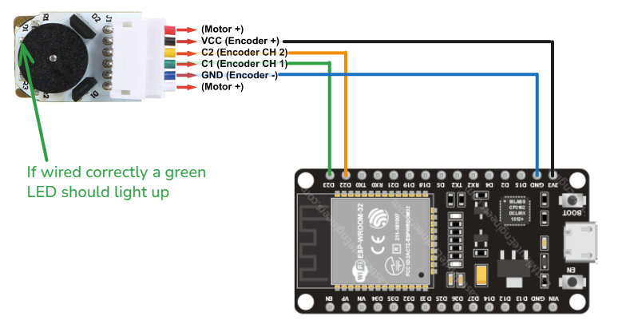

# 🔄 Encoders

Encoders are **position feedback sensors** that measure rotation of wheels, motors, or joints. They're essential for accurate robot movement control, odometry, and closed-loop motor control.

## 📘 Theory Summary

### What is an Encoder?
An encoder converts mechanical rotation into electrical signals, allowing precise measurement of:

- **Position**: How far something has rotated
- **Velocity**: How fast something is rotating  
- **Direction**: Which way rotation is occurring

### Types of Encoders

#### **Incremental Encoders**
- Output pulses for each increment of rotation
- Require counting pulses to determine absolute position
- **Common types**: Optical, magnetic, mechanical

#### **Absolute Encoders**
- Output unique value for each position
- Know absolute position immediately upon power-up
- **More complex**: Usually communicate via digital protocols

#### **Quadrature Encoders** (Most Common)
- Two incremental encoders (A and B) with 90° phase shift
- Enable direction detection and 4x resolution improvement
- **Standard in robotics** due to noise immunity and precision

---
The rest of this tutorial will cover Quadrature magnetic encoders as it's the most common encoder on cheap dc motors.

---

## 🔌 Practical Wiring

Where is the wiring for the N20 motor, the order might be different motor to motor but it's always the same a 5V or 3v3 for powering the encoder and the two chanels C1 and C2

!!! warning

    On the N20 motor default wiring the 3V3 is the black wire wich can easly be taken for ground



## 💻 Test Code

### **Making sure it works**

First it is import to make sure that the encoders works
(in my experience with esp32 for some reason it didn't work on all pins)

=== "Code"

    [:material-github: View on GitHub](https://github.com/ECN-Nantrobot/Nantrobot-Knowledge-base/blob/master/docs/Components/Sensors/encoder/encode_digital_read_test.ino){ .md-button }

    ```cpp title="encode_digital_read_test.ino"
    #include <Arduino.h>

    #define C1 23
    #define C2 22

    void setup(){
        Serial.begin(115200);
        
        pinMode(C1, INPUT_PULLUP);
        pinMode(C2, INPUT_PULLUP);
        
        Serial.println("Encoder Test - Reading both channels");
        Serial.println("Rotate the encoder to see signal changes");
        Serial.println("Format: C1_state | C2_state");
    }

    void loop(){
        int c1_state = digitalRead(C1);
        int c2_state = digitalRead(C2);
        
        Serial.print("C1: ");
        Serial.print(c1_state);
        Serial.print(" | C2: ");
        Serial.println(c2_state);
        
        delay(100);
    }
    ```

=== "Expected Output"

    ```
    Encoder Test - Reading both channels
    Rotate the encoder to see signal changes
    Format: C1_state | C2_state
    C1: 1 | C2: 1
    C1: 0 | C2: 1
    C1: 0 | C2: 0
    C1: 1 | C2: 0
    C1: 1 | C2: 1
    C1: 0 | C2: 1
    C1: 0 | C2: 0
    ```

    **What you should see:**
    - Both channels alternating between 0 and 1
    - The quadrature pattern (90° phase shift between channels)
    - Direction changes when rotating the other way

    if it doesn't work try other pins (and check the led is indeed on, the connectors are very small it can be finiky)


### **Basic Counting with Interrupts**

Due to the heavy geared reduction, there are way too many changes to track them in the void loop(). Luckily, microcontrollers can link the change of state of a pin to a function that can count the impulses.

This function must be quick because it's going to be called a lot.

=== "Code"

    [:material-github: View on GitHub](https://github.com/ECN-Nantrobot/Nantrobot-Knowledge-base/blob/master/docs/Components/Sensors/encoder/encoder_interrupt_counting.ino){ .md-button }


    ```cpp title="encoder_interrupt_counting.ino"
    #include <Arduino.h>

    #define C1 23
    #define C2 22

    volatile long encoderCount = 0;

    void setup(){
        Serial.begin(115200);
        
        pinMode(C1, INPUT_PULLUP);
        pinMode(C2, INPUT_PULLUP);
        
        // Attach interrupt to channel 1 (C1)
        attachInterrupt(digitalPinToInterrupt(C1), encoderISR, CHANGE);
        
        // Read initial state
        lastStateC1 = digitalRead(C1);
        
        Serial.println("Encoder Interrupt Test Started");
        Serial.println("Rotate the encoder to see counts");
    }

    void loop(){
        static long lastPrintedCount = 0;
        
        long currentCount = encoderCount;  // Read volatile variable once
        
        Serial.print("Count: ");
        Serial.print(currentCount);
        Serial.print(" | Change: ");
        Serial.println(currentCount - lastPrintedCount);
        
        lastPrintedCount = currentCount;
        
        delay(200);  // Print every 200ms
    }

    // Interrupt Service Routine (ISR) - Keep it fast!
    // Simplified ISR - no need for lastStateC1
    void encoderISR() {
        int stateC1 = digitalRead(C1);
        int stateC2 = digitalRead(C2);
        
        // Since we only trigger on C1 changes, we know it changed
        if (stateC1 == stateC2) {
            encoderCount--;  // Counter-clockwise
        } else {
            encoderCount++;  // Clockwise
        }
    }
    ```

=== "Expected Output"

    ```
    Encoder Interrupt Test Started
    Rotate the encoder to see counts
    Count: 0 | Change: 0
    Count: 42 | Change: 42
    Count: 156 | Change: 114
    Count: 298 | Change: 142
    Count: 298 | Change: 0
    Count: 187 | Change: -111
    Count: 45 | Change: -142
    Count: 0 | Change: -45
    ```

    **What you should observe:**
    - Positive counts when rotating clockwise
    - Negative counts when rotating counter-clockwise
    - Much higher sensitivity than the basic digital read test
    - Counts accumulate even during fast rotation

    !!! tip "Troubleshooting"
        - If direction is reversed, swap C1 and C2 pin definitions

!!! info "Go Further: 4x Precision"
    Since on the ESP32 all digital pins are capable of doing interrupts, it's possible to have interrupts on both pins for added precision. This technique called **4x decoding** captures every edge transition on both channels, giving you 4 times more resolution - perfect for precise positioning applications.

### **Converting to Speed (CPS)**

To measure how fast the encoder is rotating, we can calculate **Counts Per Second (CPS)** from our interrupt counting:

=== "Code"

    [:material-github: View on GitHub](https://github.com/ECN-Nantrobot/Nantrobot-Knowledge-base/blob/master/docs/Components/Sensors/encoder/encoder_speed_cps.ino){ .md-button }


    ```cpp title="encoder_speed_cps.ino"

    void loop(){
        static long lastPrintedCount = 0;
        static unsigned long lastTime = 0;
        
        unsigned long currentTime = millis();
        long currentCount = encoderCount;  // Read volatile variable once
        
        // Calculate counts per second
        float deltaTime = (currentTime - lastTime) / 1000.0;  // Convert to seconds
        long deltaCount = abs(currentCount - lastPrintedCount);
        float countsPerSecond = deltaCount / deltaTime;
        
        Serial.print("Count: ");
        Serial.print(currentCount);
        Serial.print(" | Change: ");
        Serial.print(currentCount - lastPrintedCount);
        Serial.print(" | CPS: ");
        Serial.println(countsPerSecond, 1);
        
        lastPrintedCount = currentCount;
        lastTime = currentTime;
        
        delay(200);  // Print every 200ms
    }
    ```

=== "Expected Output"

    ```
    Count: 0 | Change: 0 | CPS: 0.0
    Count: 50 | Change: 50 | CPS: 250.0
    Count: 200 | Change: 150 | CPS: 750.0
    ```


This gives you the rotation speed in counts per second. To convert to RPM (Revolutions Per Minute), simply divide the CPS by your motor's pulses per revolution - which you can measure by doing the boring gear reduction + encoder calculation or you can just do 10 manual wheel turns and dividing the total count by 10.

---

## 🧭 Related Topics

### **Motor Speed Control**
With encoder speed feedback, you can implement precise **closed-loop motor control**. Instead of just setting motor power, you can control actual wheel speed using PID controllers for consistent robot movement.

### **Robot Odometry** 
Using wheel encoders, you can calculate your robot's **position and orientation** by tracking how far each wheel has traveled. This technique called **odometry** is fundamental for autonomous navigation.

<!-- **Next Steps:**
- **[PID Control](/knowledge_base/control/pid/)** - Precise motor speed control using encoder feedback
- **[Odometry](/knowledge_base/control/odometry/)** - Calculate robot position from encoder data -->

---
*Last updated: october 2025*


