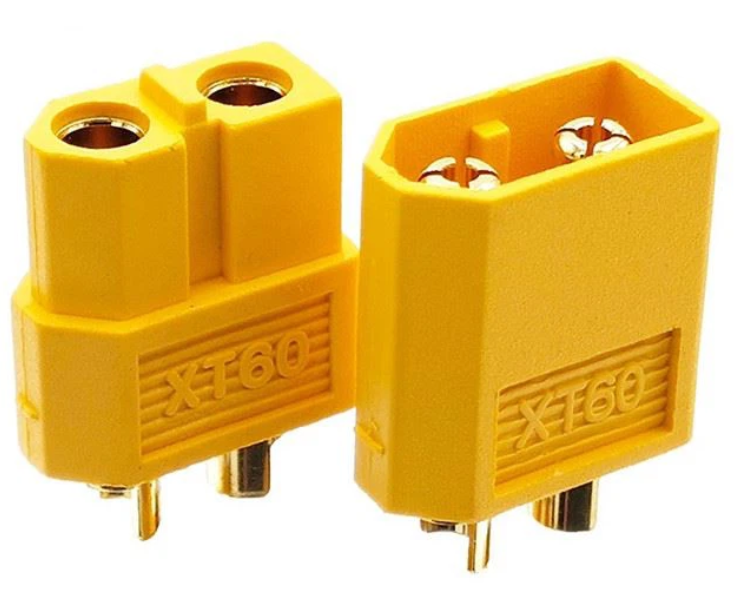
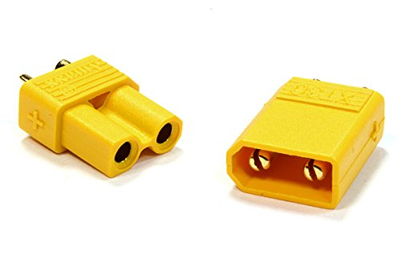
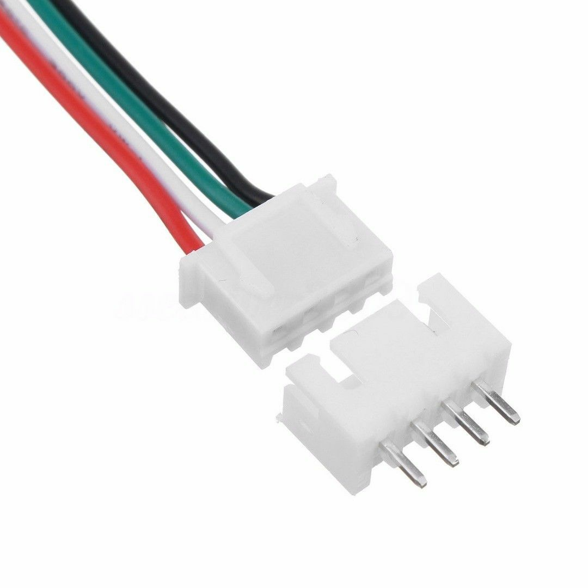
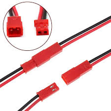
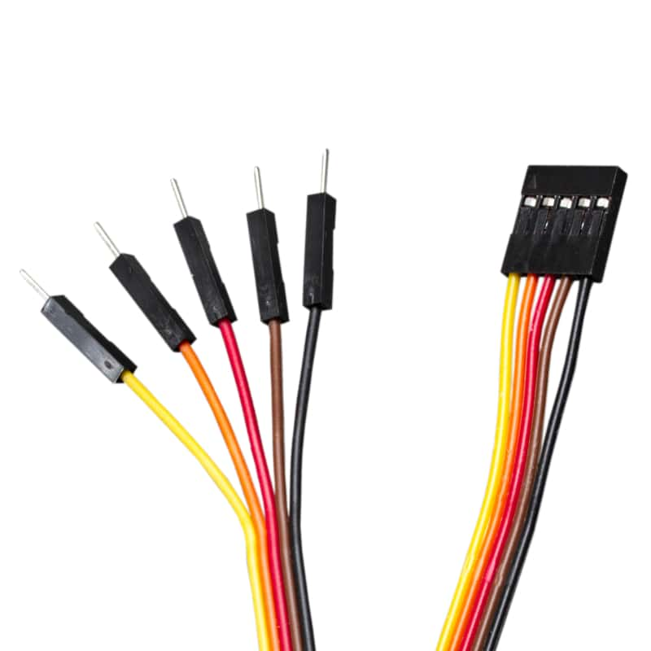
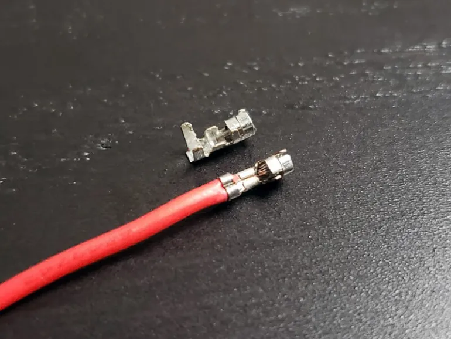
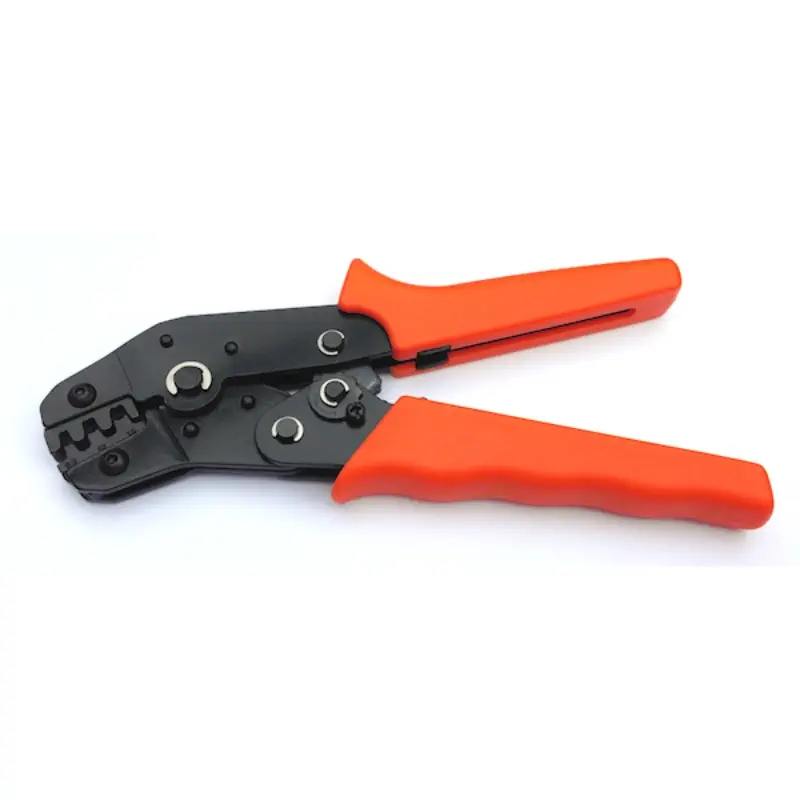
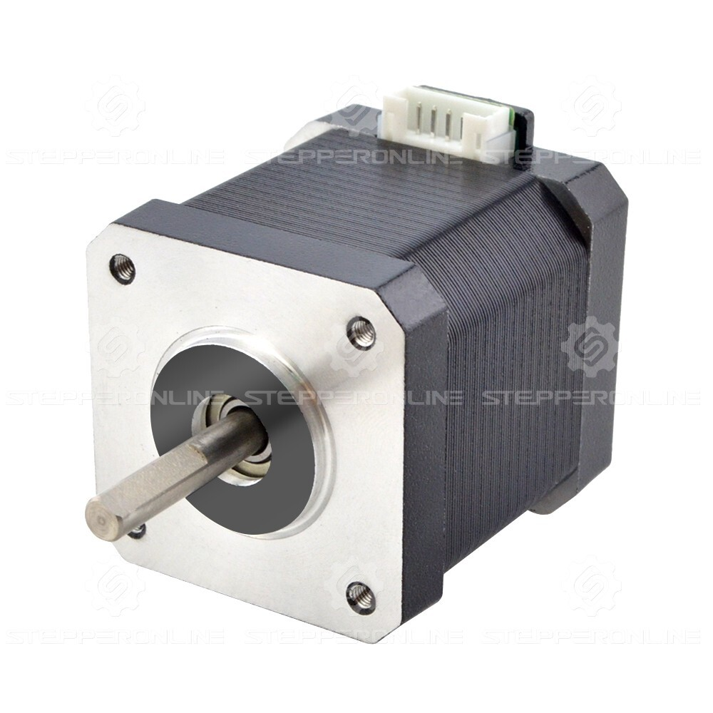
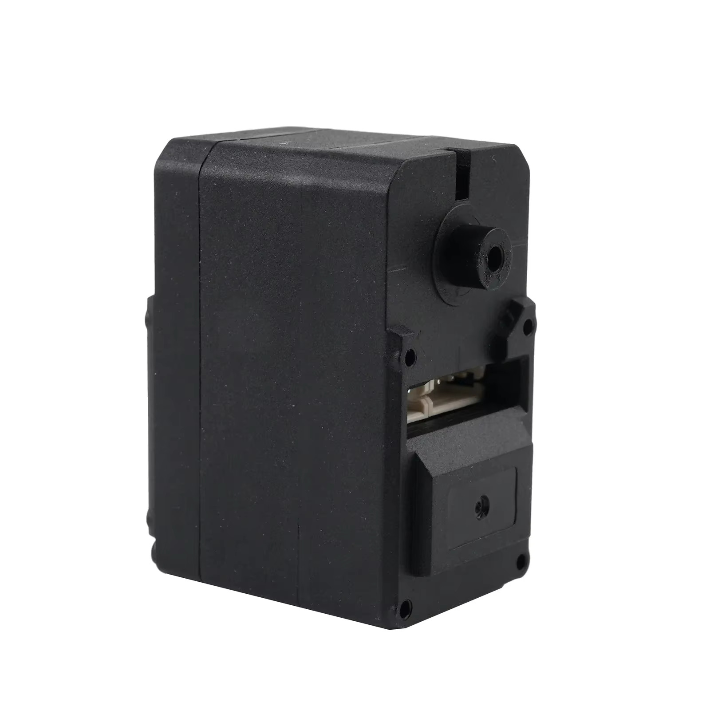

# 🔌 Connectors

Guidelines for selecting and using connectors in robotics projects.

## 🎯 Connector Selection by Application

> **Important:** Always use **female connectors on the PCB/circuit side** for standardization.

### Power Connectors

#### XT60 - High Current Applications (12V+)
- **Use for:** 12V power supply (battery to pcb)
- **Current rating:** Up to 60A
- **Wire gauge:** 12-16 AWG

{ width="50%" }

#### XT30 - Medium Power (9V)
- **Use for:** 9V power lines, medium current applications
- **Current rating:** Up to 30A
- **Wire gauge:** 16-20 AWG

{ width="50%" }

### Signal and Control Connectors

#### JST XH - General Purpose
- **Use for:** Most PCB connections, sensor interfaces, general signals
- **Pitch:** 2.5mm
- **Current rating:** Up to 3A per pin
- **Wire gauge:** 22-28 AWG

{ width="50%" }

#### JST RCY 2-pin - Buttons and Switches
- **Use for:** Push buttons, switches, simple on/off signals
- **Pitch:** 2.5mm
- **Current rating:** 1A per pin

For the SIMA it's fine to use these connector on the Estop but ideally use them only for low current applications.

{ width="50%" }

#### Dupont - Debug and Testing
- **Use for:** Temporary connections, debugging, breadboard connections
- **Pitch:** 2.54mm
- **Note:** Not recommended for permanent installations

{ width="50%" }

---

## 🔧 Crimping Tutorial

### JST XH and Dupont Connectors

1. **Strip wire:** Remove 2-3mm of insulation

2. **Position the terminal:** Place the wire in the terminal with the stripped copper in the smaller crimping tabs and the insulation in the larger tabs { width="50%" }

3. **Crimp:** Use appropriate crimping tool and apply firm pressure. The larger tabs fold over the insulation for strain relief, the smaller tabs fold over the copper for electrical connection { width="50%" }

4. **Test connection:** Gently pull wire to ensure secure mechanical connection. Mostly for jst, use multimeter in continuity mode to verify electrical connection - it's common for small wires to break during crimping

5. **Insert into housing:** Push terminal until it clicks into place

---

## 🔍 Common Connectors you can find on Components

### NEMA17 Stepper Motors
- **Connector:** JST PH 2.0 (4-pin)
- **Pitch:** 2.0mm
- **Wires:** A+, A-, B+, B-

{ width="50%" }

### Feetech STS3215 Servos
- **Connector:** 5264/2.54 3P connector
- **Pitch:** 2.54mm
- **Pins:** VCC, GND, Signal

{ width="50%" }

---

*Last updated: October 2025*