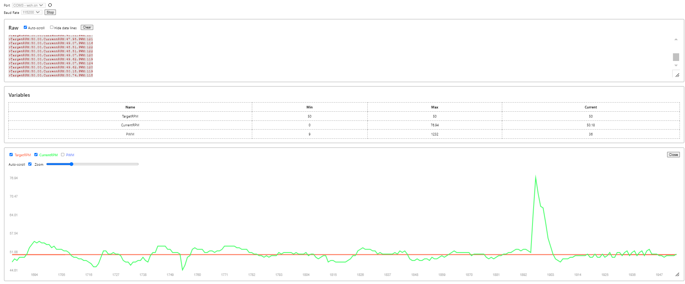

# VSCode & PlatformIO Setup

This guide covers setting up VSCode with PlatformIO for microcontroller development and how to plot data for debugging.

## Basic Setup

For a comprehensive guide on installing and configuring VSCode and PlatformIO for ESP32, ESP8266, and Arduino development, follow this tutorial:

- **[Random Nerd Tutorials: Getting Started with VS Code and PlatformIO IDE](https://randomnerdtutorials.com/vs-code-platformio-ide-esp32-esp8266-arduino/)**

---

## Plotting Values with Serial Plotter

The **Serial Plotter** is a VS Code extension for plotting numerical data received from a serial port, which is extremely useful for debugging and tuning.

### Data Format

The plotter only reads lines that start with `>`. The format must be comma-separated `variable:value` pairs.

### How to Use the Plotter

1. Install the Serial Plotter (by Mario Zechner) extension from the VS Code marketplace.
2. Open the Serial Plotter from the command palette (`Ctrl+Shift+P`).
3. Select the appropriate serial port.
4. Ensure your microcontroller is sending data in the correct format.
5. **Warning:** Close any other serial monitors to avoid conflicts.

**Example Code:**

=== "Code"


    ```cpp title="in your void loop"
    Serial.print(">");
    Serial.print("TargetRPM:");
    Serial.print(targetRPM);
    Serial.print(",");
    Serial.print("CurrentRPM:");
    Serial.print(currentRPM);
    Serial.print(",");
    Serial.print("PWM:");
    Serial.print(motorPWM);
    Serial.println();
    ```

=== "Serial monitor output"

    ```
    >TargetRPM:50.00,CurrentRPM:50.18,PWM:108
    >TargetRPM:50.00,CurrentRPM:50.18,PWM:108
    >TargetRPM:50.00,CurrentRPM:49.07,PWM:113
    >TargetRPM:50.00,CurrentRPM:49.62,PWM:108
    >TargetRPM:50.00,CurrentRPM:48.51,PWM:115
    >TargetRPM:50.00,CurrentRPM:48.51,PWM:114
    >TargetRPM:50.00,CurrentRPM:48.51,PWM:115
    >TargetRPM:50.00,CurrentRPM:49.07,PWM:113
    >TargetRPM:50.00,CurrentRPM:48.51,PWM:118
    >TargetRPM:50.00,CurrentRPM:48.51,PWM:117
    >TargetRPM:50.00,CurrentRPM:48.51,PWM:118
    >TargetRPM:50.00,CurrentRPM:49.07,PWM:117
    >TargetRPM:50.00,CurrentRPM:48.51,PWM:122
    ```
=== "Serial Plotter Output"
    { width="100%" }