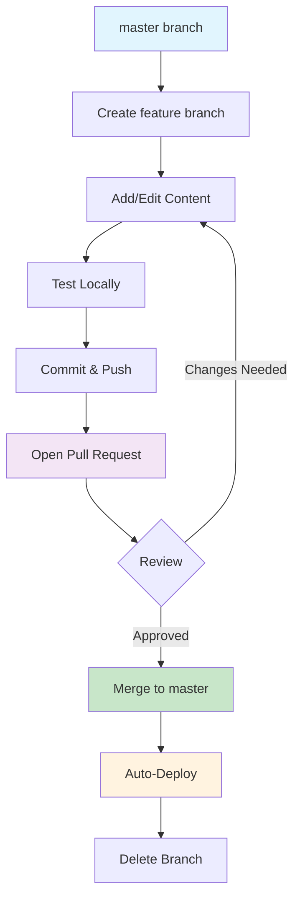

# 🤝 Contributing to Nantrobot Knowledge Base

## 💡 Not Ready to Git Yet?

If you're not comfortable with Git workflows yet, **no worries!** You can still contribute valuable knowledge:

- Write your content in a Markdown file (.md)
- Send it to a project maintainer via email or messaging
- We'll help integrate it into the knowledge base and give you full credit

*This is a great way to start contributing while learning the technical workflow.*

---

## ⚙️ 1️⃣ Before You Start

### ✅ Requirements

- Git and a GitHub account
- python
- MkDocs installed locally (for preview):

```bash
pip install mkdocs mkdocs-material
```

- Clone the repo:

```bash
git clone https://github.com/ECN-Nantrobot/Nantrobot-Knowledge-base.git
cd Nantrobot-Knowledge-base
```

---

## ✨ 2️⃣ Create a New Branch

Each contribution (tutorial, fix, new section, etc.) should be in its own branch.

```bash
git checkout master
git pull origin master
git checkout -b feature/<short-description>
```

### Examples:
- `feature/add-encoder-tutorial`
- `fix/typo-in-motor-doc`

### 📘 Naming Convention
- Use lowercase and dashes
- Prefix with `feature/` or `fix/`

---

## 🧩 3️⃣ Add or Edit Content

Add Markdown files (`.md`) in the appropriate folder (`components`, `electronics`, `mechanics`, etc.).

For detailed guidelines on content structure, formatting, and standards, see our **[Content Guidelines](/contributing/content-guidelines/)** *(coming soon)*.

---

## 🧱 4️⃣ Test the Documentation Locally

To preview changes:

```bash
mkdocs serve --livereload
```

Then open http://127.0.0.1:8000 in your browser.
Make sure everything renders correctly.

---

## 🧾 5️⃣ Commit and Push

```bash
git add .
git commit -m "feat: Add encoder tutorial and test code"
git push -u origin feature/add-encoder-tutorial
```

---

## 🚀 6️⃣ Open a Pull Request (PR)

1. Go to the GitHub repo page
2. You'll see a banner: "Compare & pull request" → click it (if you don't see go the branch by clicking on (:octicons-git-branch-16: master), your branch and you will have a (:octicons-git-pull-request-16: contribute) button)
3. Write a short, clear description of what you added or changed
4. Submit the PR to (:octicons-git-branch-16: master)

🧪 **The GitHub Action will automatically:** Build the MkDocs site, you will see if it can or not build

---

## 🧭 7️⃣ Review & Merge

1. Another member (or you, if solo) reviews the PR
2. Once approved → Merge into `master`
3. GitHub Action will then auto-deploy the updated documentation to GitHub Pages

---

## 🧹 8️⃣ Clean Up Branches

After the PR is merged:

```bash
git checkout master
git pull
git branch -d feature/add-encoder-tutorial
git push origin --delete feature/add-encoder-tutorial
```

*(You can also click "Delete branch" directly on GitHub.)*

---

## 🧠 For External Contributors

If you're not a club member but want to contribute:

1. Fork the repository instead of creating a branch directly
2. Make your changes in your fork
3. Open a Pull Request from your fork to our main repository

---

## ✅ Summary Workflow



---

**Questions?** Feel free to ask in our project channels or open an issue on GitHub!